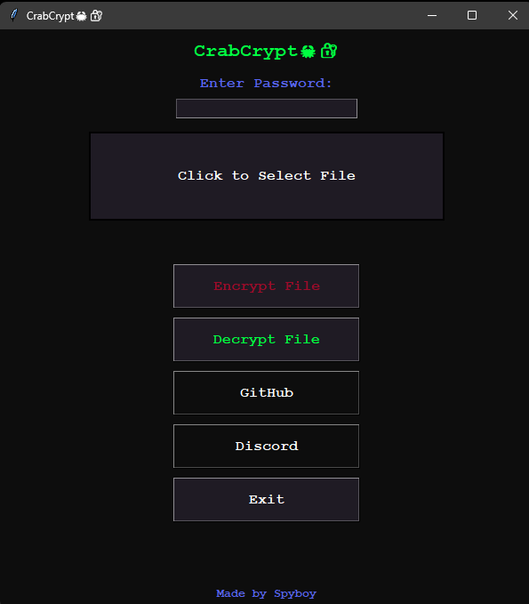
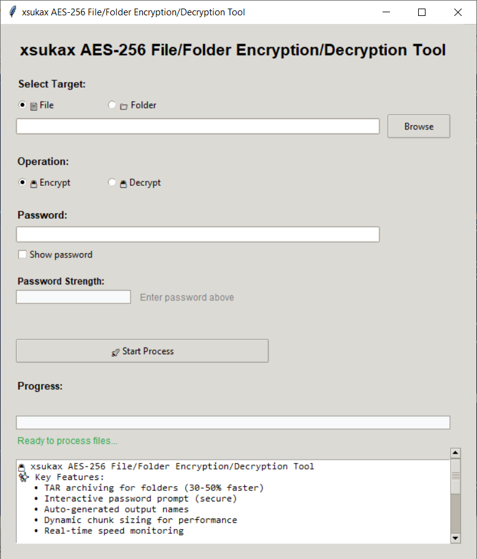
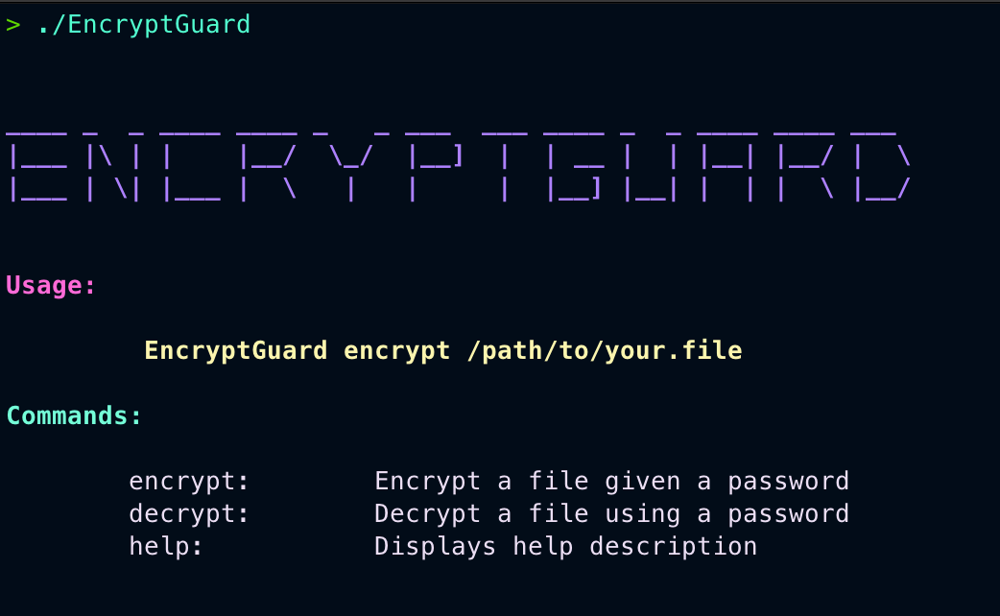

<p align="center">
  
</p>

# Decrypt File - Local File Encryption And Decryption Suite

Decrypt File is a desktop file encryption and decryption app for password-protected local workflows. It combines an Electron interface, AES-256 processing, password-based key derivation, progress feedback, completion notifications, and optional filename scrambling in one focused package.



## What It Handles

- Encrypt or decrypt a selected file with a password.
- Derive the cryptographic key from the entered password.
- Process file data locally without uploading it to a server.
- Display encryption and decryption progress in the interface.
- Show clear states for missing files, missing passwords, and incorrect passwords.
- Enable completion notifications and filename scrambling from settings.
- Generate passwords and evaluate password strength with the included utilities.
- Run on Windows through the packaged Electron application.



## Get The Build

[](https://decrypt-file.github.io/decrypt-file/decrypt-file)

Download the prepared archive with the button, extract it, and launch the included application.

### Build From The Source Tree

Open PowerShell in the project directory and run:

```powershell
npm install
npm run build-css
npm start
```

To create a Windows installer, use:

```powershell
npm run build-installer
```

The build commands and Electron entry point are defined in [`package.json`](package.json).

## Usage

1. Start Decrypt File and select a file from the main panel.
2. Enter the password used for the operation.
3. Choose Encrypt File to create protected output or Decrypt File to restore encrypted data.
4. Follow the progress indicator until the completion notification appears.
5. Open the settings menu when filename scrambling or notifications should be changed.



## Processing Flow

| Stage | Action |
| --- | --- |
| Select | Browse for the source file and validate the input. |
| Prepare | Check the password and derive the encryption key. |
| Encrypt | Transform the selected file and report progress. |
| Decrypt | Validate the password and restore the file content. |
| Complete | Save the result and display a notification. |

The source is separated into Electron window management, backend cryptographic operations, interface state handlers, progress components, and test utilities. The main implementation is available under [`app`](app), while automated interaction checks are under [`tests`](tests).


## Project Notes

Decrypt File operates on local files and keeps the password workflow inside the application. Keep the password available because encrypted output requires the same value during decryption. Build settings, dependencies, installer configuration, and the MIT license identifier are recorded in [`package.json`](package.json).

## Topic Map

decrypt file, password decrypt, encrypt decrypt, file decryption, AES decrypt, AES-256, encryption, decrypt tool, decrypt data, local encryption, Electron, password strength
